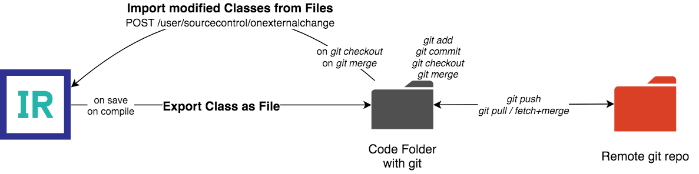
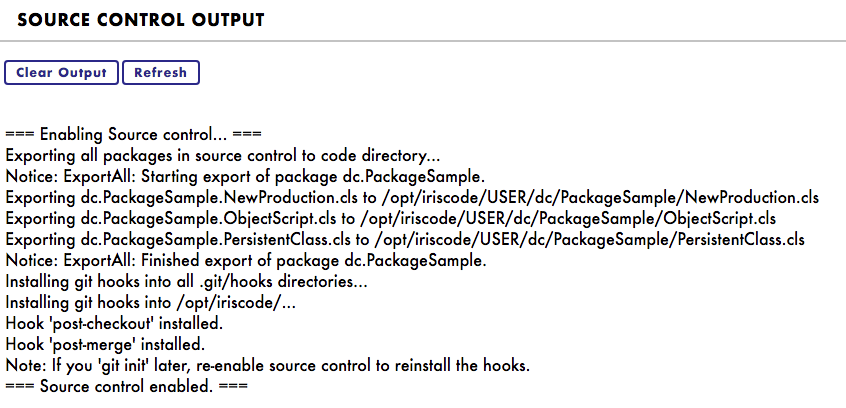

# Git for IRIS

[](https://openexchange.intersystems.com/package/git-for-iris)
[](https://github.com/MW-de/git-for-iris)
[](https://www.intersystems.com/products/intersystems-iris/)
[](https://opensource.org/licenses/MIT)

**Git for IRIS** is a Source Control package that aims to facilitate a  **native integration of the Git workflow** with the InterSystems IRIS platform.

Similar to Caché Tortoize Git and Port, **Git for IRIS keeps a *code directory* in sync with the internal packages that can be put under source control with Git.** However, it is designed to work as a transparent link between IRIS and Git that, once setup, requires no user interaction in IRIS.

To use it, either **run the docker example** or **install Git for IRIS on an existing IRIS instance**.

## How it works

### Basic principles 

- **Server-based:** Git for IRIS runs on the IRIS server (not in Studio or VSCode).
- **Tasks performed in IRIS:** Create and edit code. Nothing else, source control-wise.
- **Tasks performed in Git:** `git *`: commit, push/pull, branch switching, merge.



## Change log

### v0.3

- Added automatic deletion of files upon deletion of the class
- Added support for lookup tables
- Added log levels which can be adjusted via the `LogLevel` setting
- Git Hooks are now disabled by default
- Settings will be initialized automatically now
- Added guide for manual installation

### v0.2.2

- Fix path error in Utils.cls

### v0.2.1

- Update module.xml

### v0.2

- Classes are now compiled after import.
- The REST endpoint for the Git hooks (`/csp/user/sc`) is now secured by an IRIS user and a (randomly generated) password. A new password is generated every time the source control is (re-)activated and the git hooks are installed.

## Manual Installation on IRIS

To install **Git for IRIS** on an existing IRIS instance, do the following:

### Import Code
- Import all code files from `SourceControl/Git` into a database of your choice. In this guide, `USER` will be assumed.

### Mapping of the code package and settings Global into namespaces
- Map **package** `SourceControl` from `USER` into the namespaces that will use source control. To use it globally, the package can be mapped into `%All`.
- Map **Global** `Git.*` from `USER` into the namespaces that will use source control. It can be mapped into `%All`, too.

**Note:** It is safe to map the package and Global into `%All` even when Source Control will only be used in *some* namespaces for *some* packages. Unless there is a specific reason to use independent packages or `Git.*` Globals among namespaces, mapping into `%All` is recommended for its simplicity.

### Manage packages in Source Control

To specify the packages that will be under source control use these API methods:
```
do ##class(SourceControl.Git.Utils).AddPackageToSourceControl(<package name>, <namespace>)
do ##class(SourceControl.Git.Utils).RemovePackageFromSourceControl(<package name>)
```

For each package, a `<namespace>` must be specified into which the package will be imported (since the namespace of a class may be ambiguous through mappings).

### Setup Source Control in Management Portal

- In the **Management Portal** go to **System Administration > Configuration > Additional Settings > Source Control**

- **For all namespaces** that should be set up for Source Control, choose **SourceControl.Git.Git** and save.

**Note:** If classes are shared among namespaces through package mappings, it is practical to set up Source Control **for all relevant namespaces**. Each package will always be imported and exported from and to its 'home namespace' as defined in `AddPackageToSourceControl`, so there will be no conflicts by having source control enabled in multiple namespaces at the same time.


### Git for IRIS Settings

- Access the **Source Control Menu**, e. g. in a [production](http://localhost:9092/csp/user/EnsPortal.ProductionConfig.zen?PRODUCTION=dc.PackageSample.NewProduction) in a namespace with source control set up as described above (see screenshot below).
- Go to **Settings**.
- The Global `Git.Config` will open on the View Global Data page and can be edited there. There is no dedicated settings GUI at the moment.

|Settings|Default|Description|
|---|---|---|
|`CodeDirectory`|/opt/iriscode/|The directory to save the code files to. Usually the directory that is put under Git. Use OS-specific slashes.|
|`CompileFlags`|cuk|Flags to compile the classes with after import|
|`Enabled`|0|Enable or disable source control (accessible through the Source Control Menu > Enable/Disable Source Control)|
|`HooksEnabled`|0|Whether to enable the git hooks and install git hooks into `<CodeDirectory>/.git` dir. The `REST*` and `SourceControlResource` settings can be ignored if hooks are disabled.
|`LogLevel`|1|`0 = error` / `1 = important` / `2 = info`
|`RESTUrlPath`|/csp/user/sc|Path of the web application the git hooks will call
|`RESTUrlPrefix`|http://localhost:52773/|The base URL of this IRIS instace for the git hooks
|`RESTUsername`|git|The username the git hooks use for authentication. Git for IRIS will **assign a random password to this user** upon installing the git hooks which is not stored anywhere except inside the git hooks scripts.
|`SourceControlResource`|SourceControl|The security resource needed to access the web application

### Enable Git for IRIS source control

- Before enabling source control, **ensure that the `CodeDirectory` setting points to a valid folder**.
- In the **Source Control Menu**, choose `Enable Source Control`.

Enabling source control will:
- Enable *OnAfterSave*, *OnAfterCompile* and *OnAfterDelete* hooks which export the modified class or lookup table from IRIS to the code directory.
- Install the git hooks (if setting `HooksEnabled = 1`) which import classes from the code directory into IRIS (see section *Git Hooks* below).
- Run **Export all changed**: exports all classes and lookup tables currently under source control to the code directory.

If the code directory has gone out-of-sync in the meantime, IRIS still exports the current internal state of all classes, and potential conflicts shall, by design, be managed through Git (`git merge`).

### Result

Now, with source control enabled, classes will be written to the code directory upon every save, compile or delete event. The code directory is designed to be put under source control with Git.

### Optional: Git Hooks

Git hooks can bee used to automatically trigger **Import all changed** upon `git checkout` and `git merge`.

- Create a user, role and resource by using the three commands in `iris.script` (or do so manually).
- Create a Web Application as described in `module.xml`. The path and the required resource may be changed as desired and must match the `RESTUrlPath` and `SourceControlResource` settings.

**Note:** Git hooks are optional; the same functionality can be achieved by running **Import all changed** manually in the source control menu when files in the code directory have been updated.

## Running the Docker example

- Clone repo, build and run the docker image from a terminal window:
```
git clone https://github.com/MW-de/git-for-iris.git
cd git-for-iris
./docker-build.sh
docker-compose up -d
```

- Go to **Management Portal** in http://localhost:9092/csp/sys/UtilHome.csp (Login with `_system:SYS`) and [activate the source control class](https://docs.intersystems.com/irislatest/csp/docbook/Doc.View.cls?KEY=ASC#ASC_Hooks_activating_sc_class):

- Go to **System Administration > Configuration > Additional Settings > Source Control**

- For namespace **USER**, choose **SourceControl.Git.Git** and save.

- Access the source control menu, e. g. in a [production](http://localhost:9092/csp/user/EnsPortal.ProductionConfig.zen?PRODUCTION=dc.PackageSample.NewProduction), and click **Enable Source Control**.


The source control output window can be opened by clicking on the second item: 



## Usage

Git for IRIS is used with a Git client. You may use the command line Git client or an IDE like VSCode (optionally with Remote SSH). In this docker example, the `git` client will be used within the docker image. In the terminal window, run:

```
docker-compose exec -u 52773 iris-git /bin/bash
cd /opt/iriscode
```

### Usage example with Git

You may now edit some code in IRIS. As an example, go to **[Interoperability > Business Process Designer](http://localhost:9092/csp/user/EnsPortal.BPLEditor.zen?$NAMESPACE=USER&$NAMESPACE=USER&)** and create a new BPL process. Save it in package `dc.PackageSample` as `SampleBPLProcess`. Since the `dc.PackageSample` package is under source control, it will be exported to `/opt/iriscode`. In the docker terminal, run:

```
git add .
git commit -m "add new BPL process"
```
Now let's create a branch:

```
git checkout -b testing-branch
```
Back in the BPL editor, **make some changes** in `dc.PackageSample.SampleBPLProcess`, like adding a BPL element to it, and save the BPL process.

```
git commit -a -m "change BPL process"
```

Now let's switch back to the master branch:

```
git checkout master
```

... and refresh the browser window. The BPL will be reverted to the state in `master`. Switching branches again ...

```
git checkout testing-branch
```
... will get the newer version back.

This workflow extends to all other actions in Git, including working with remote repos and pull/merge.

## Detailed description

### Workflow

- **Automatic Export:** IRIS exports all changes to the code directory upon save and compile.
- **Automatic Import:** Git informs IRIS about updates (pull/merge, checkout) via Git hooks, which triggers import of changed classes through a REST endpoint in IRIS. Disabled by default - set `HooksEnabled` to `1` in the Settings to enable.
- **Conflicts:** All conflicts are managed through Git.
- **Explicit import/export**: Although there are menu items to import and export the classes, **no user interaction is required** in regular workflows.
- **Git control:** IRIS does not execute any Git commands. Instead, Git is used natively through the command line or an IDE (e.g. VSCode with Remote SSH). As a developer, you operate on the code directory as you would on any other development workspace.

### Details

- **Configuration:** Source control can be configured namespace-wise. Mapping of the Global `Git.*` among multiple namespaces makes them share the same source control configuration.
- Git for IRIS is **package-based**. No projects are supported.
- For each package and its subpackages, there is an "owner" namespace where exporting and importing happens.
- **Class export format** is UDL.

### Globals

|Global|Description|
|--|--|
|`Git.Config`|The settings as described above
|`Git.Data.PackagesD`|The packages and their "home" namespaces that are under source control
|`Git.Data.Items`|For each item (= class) under source control, the internal timestamp, file timestamp and file size to determine whether and item has changed in IRIS or in the code directory.

## TODOs and limitations

**Git for IRIS** is currently in beta. The core features are implemented and ready to use. Known limitations are:

- Currently, only classes and lookup tables are supported.
- UI controls are rudimentary or not implemented yet (add/remove packages from source control, settings).
- No git hook is available for `git stash`, so IRIS will not be notified about stashing.
- Importing Classes via Management Portal does not trigger an automatic export to the Git directory - it bypasses Source Control hooks for some reason. Use `Export All Changed` after importing classes.
- `Import All` / `Import All Changed` immediately imports all classes from the Git directory to IRIS. If the directory has gone out of sync with the IRIS codebase (e.g. upon an import via Management Portal), changed will be overwritten without notice.

## Acknowledgement

This project is based on [Caché Tortoize Git](https://openexchange.intersystems.com/package/Cach%C3%A9-Tortoize-Git) by Alexander Koblov. This project started as a fork of the original project, however, most of the code has been rewritten.
